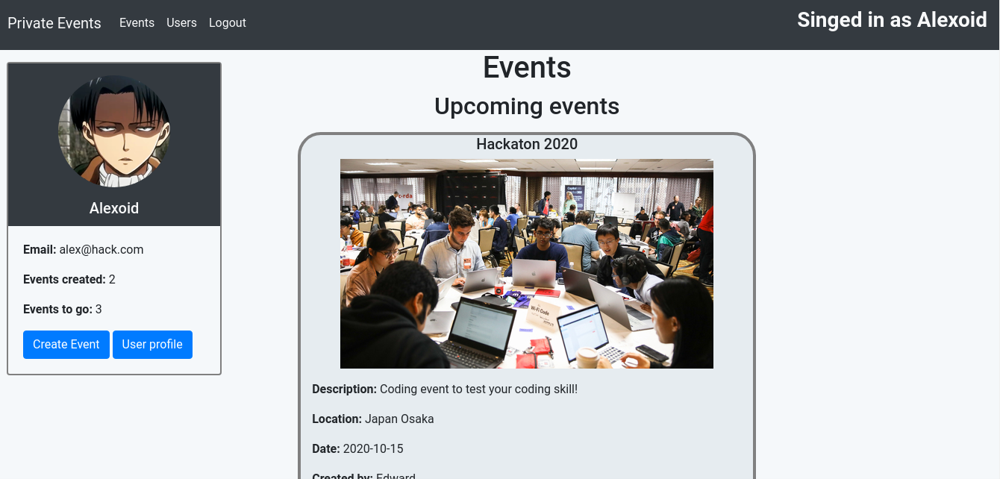
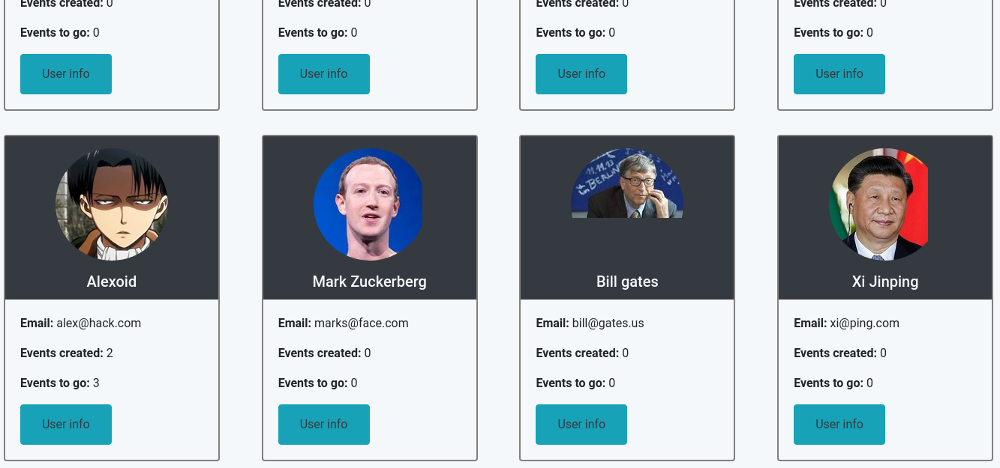
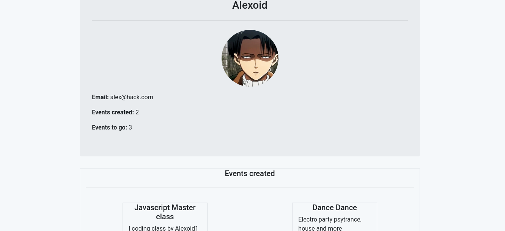

# Private events

> In this project, I build a site similar to a private Eventbrite with authentication and association between components. 

## Events

## Users list 

## Profile

## Getting Started
- Go to (https://github.com/Alexoid1/Private-events) and have a look around.
- Open your Terminal.
- Install Imagemagick (brew install imagemagick)
- Clone repo
- Go to the project's root
- Type (bundle install)
- Start server (rails server).
- In your browser open: http://localhost:3000/

## Live Demo

[Live Demo Link](https://private-eevents.herokuapp.com/events)

## In this project:
- User authentication without use the divise gem.
- Seesions.
- Association many through many
- Set bootstrap in a rails app.
- Use helpers and scopes.

## Built With

- Ruby on Rails
- Paperclip
- Bootstrap

### Prerequisites

- Browser
- Internet
- Imagemagick (brew install imagemagick)

## Credit

- The Odin project (https://www.theodinproject.com/courses/ruby-on-rails/lessons/associations)

## Authors

👤 **Pablo Alexis Zambrano Coral**

- Github: [@Alexoid1](https://github.com/Alexoid1)
- Twitter: [@pablo_acz](https://twitter.com/pablo_acz)
- Linkedin: [linkedin](https://www.linkedin.com/in/pablo-alexis-zambrano-coral-7a614a189/)

## 🤝 Contributing

Contributions, issues and feature requests and any type of feedback to improve are welcome!

## Show your support

Give a ⭐️ if you like this project!

## 📝 License

This project has no license.
